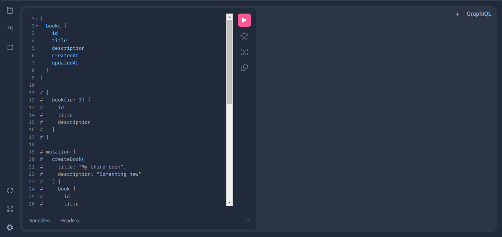
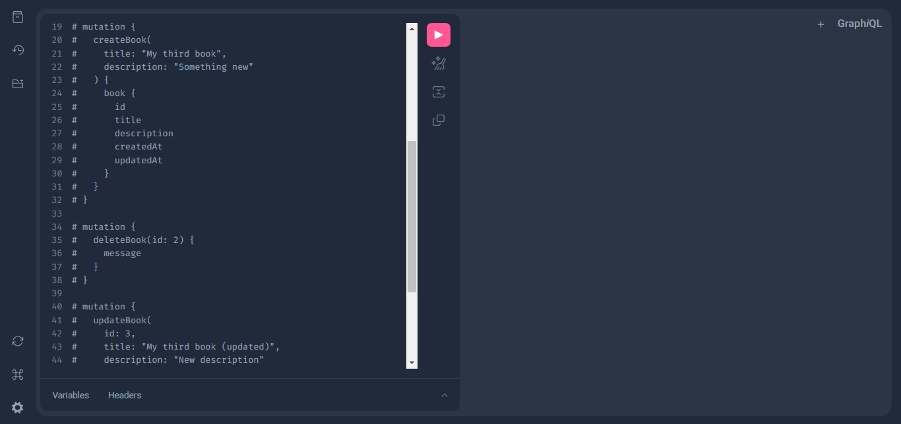
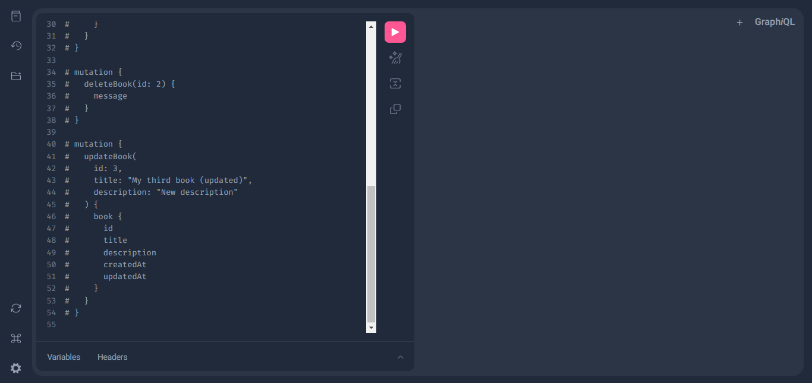

# GraphQL API built with Django, Python and Graphene (Python module)

This is a simple example of a API built with Python and Django. This API allows us to make a CRUD working with books. 
Those books have an id, title, description, createdAt and updateAt (the last two fields are creation and update dates).
This project is based on [Fazt](https://youtu.be/cultgNYc1DE), a great YouTube Channel related to programming.

*Note: Venv (python internal module) was used as virtual enviroment*

### Previews

